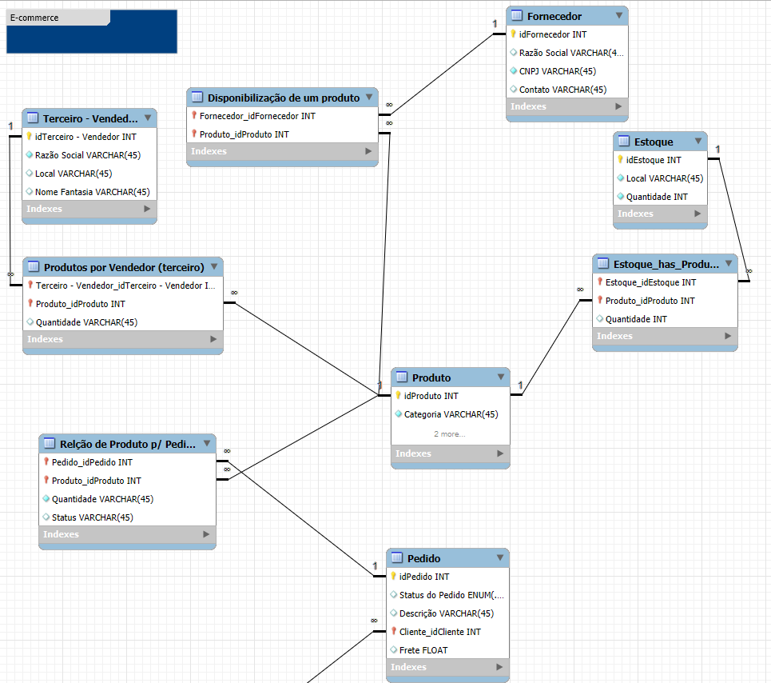

# 🛒 Desafio DIO - Projeto Lógico de Banco de Dados: E-commerce

Este repositório contém a entrega do desafio **"Construindo seu Primeiro Projeto Lógico de Banco de Dados (ECOMMERCE)"** proposto no Bootcamp **Geração Tech Unimed-BH - Ciência de Dados** na plataforma [DIO](https://www.dio.me/).


## 📸 Diagrama ER (Modelo Entidade-Relacionamento)




📚 **Instrutora:** Juliana Mascarenhas  
🛠️ **Ferramenta utilizada:** MySQL Workbench 8.0 CE

---

## 📌 Descrição do Desafio

Neste desafio, foi proposta a modelagem lógica de um banco de dados para um **cenário fictício de e-commerce**. A proposta envolve a construção do diagrama entidade-relacionamento e a criação do script SQL com a estrutura do banco de dados, incluindo:

- Definições de chaves primárias e estrangeiras
- Criação de constraints
- Relacionamentos presentes no modelo EER
- Mapeamento e refinamento conforme orientações do módulo

---

## 🎯 Objetivo

> Refine o modelo apresentado acrescentando os seguintes pontos:

- Um cliente pode ser **Pessoa Física (PF)** ou **Pessoa Jurídica (PJ)**, **mas não ambos**
- O cliente pode ter **múltiplas formas de pagamento**
- As entregas devem conter **status** e **código de rastreio**
- Utilização de **queries SQL complexas** conforme abaixo

---

## 🗃️ Estrutura do Projeto

📁 ecommerce-db
├── script_estrutura.sql # Script com a criação do banco de dados e tabelas
├── queries_teste.sql # Consultas SQL com SELECT, JOIN, WHERE, HAVING, ORDER BY etc.
├── diagrama.png # (Opcional) Diagrama ER exportado do MySQL Workbench
└── README.md # Descrição completa do projeto

sql
Copiar
Editar

---

## 🔎 Consultas SQL Aplicadas

As consultas foram elaboradas com base em perguntas reais que um sistema de e-commerce poderia responder. Foram utilizadas cláusulas como:

- `SELECT` com filtros (`WHERE`)
- Expressões para atributos derivados (ex: total de pedidos, idade do cliente, etc.)
- Ordenações com `ORDER BY`
- Agrupamentos com `GROUP BY` e filtros com `HAVING`
- Junções (`JOIN`) entre múltiplas tabelas

---

## 🧪 Exemplos de Consultas

```sql
-- Total de pedidos por cliente
SELECT c.nome, COUNT(p.id_pedido) AS total_pedidos
FROM cliente c
JOIN pedido p ON c.id_cliente = p.id_cliente
GROUP BY c.nome;

-- Listar pedidos com status e código de rastreio
SELECT p.id_pedido, e.status_entrega, e.codigo_rastreamento
FROM pedido p
JOIN entrega e ON p.id_pedido = e.id_pedido;

-- Clientes PF com mais de 2 pedidos
SELECT c.nome, COUNT(p.id_pedido) AS qtd_pedidos
FROM cliente c
JOIN pedido p ON c.id_cliente = p.id_cliente
WHERE c.tipo = 'PF'
GROUP BY c.nome
HAVING COUNT(p.id_pedido) > 2;
🧱 Modelo Lógico
O banco de dados contempla as seguintes entidades:

Cliente (PF/PJ)

Produto

Estoque

Fornecedor

Pedido

Entrega

Forma de Pagamento

Venda de Produtos (Itens do Pedido)

O modelo foi desenvolvido com base em boas práticas de modelagem relacional, respeitando integridade referencial e normalização.

🚀 Como Executar o Projeto
Abra o MySQL Workbench

Importe e execute o script_estrutura.sql

(Opcional) Execute as consultas do queries_teste.sql

Explore a estrutura e testes do banco de dados

📸 Diagrama ER (Modelo Entidade-Relacionamento)
(adicione a imagem abaixo, se desejar)


👩‍💻 Autora
Feito com 💙 por Tatiana Kami
Bootcamp DIO

📎 Licença
Este projeto é apenas para fins educacionais.